## 1. Configure Name
```
git config --global user.name "username"
```
Example
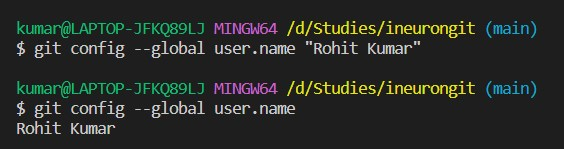

## 2. Configure Email
```
git config --global user.email "email@example.com"
```
Example
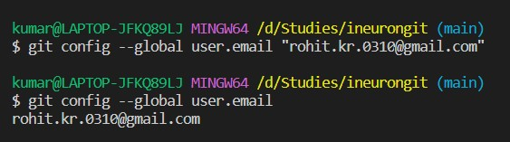

## 3. Git status
```
git status
```
Example
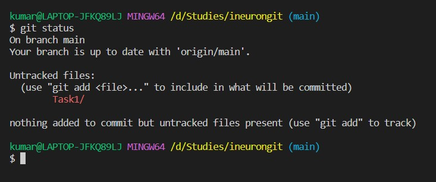

Shows information about the current changes ( new files added, updated, deleted, renamed etc)

## 4. Git Add
```
git add .
```
Adds all the current changes to the staging area.

```
git add <filename>
```
Adds the specic file to the staging area.
Example
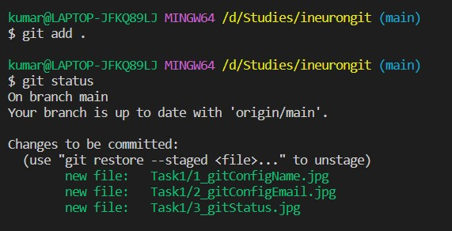

## 5. Commit
```
git commit -m "Commit messege"
```
Example
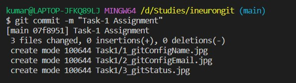

Commits the changes

## 6. Push

```
git push origin main
```
Example
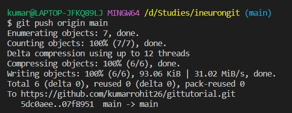

Push the changes in the staging area to the remote main branch. We can replace the main branch with any other branch name.

## 7. Fetch

```
git fetch
```
Example
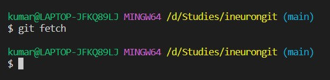

Updates the repository by downloading the objects and refs.

## 8. Pull

```
git pull
```
Example
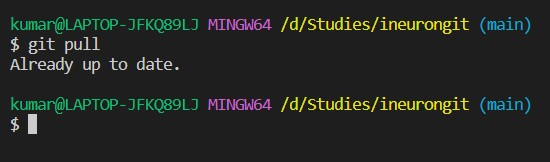

Fetches and Pulls the changes from the remote repository to the local branch.

## 9. Create new branch

```
git branch <new branch name>
```
Example
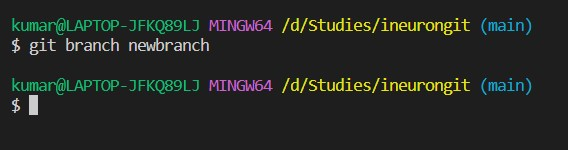

Creates a new branch with given name.

## 10. List all branch on local

```
git branch
```
Example
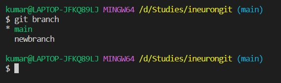

Lists all branch that are present on local repository.

## 11. Switch to new branch

```
git switch <branch name>
```
or
```
git checkout <branch name>
```
Example
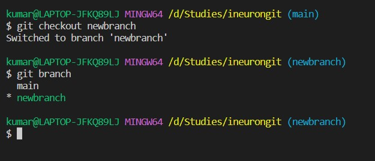

Switch to the given branch name.

## 12. Merge

```
git merge <branch name>
```
Example
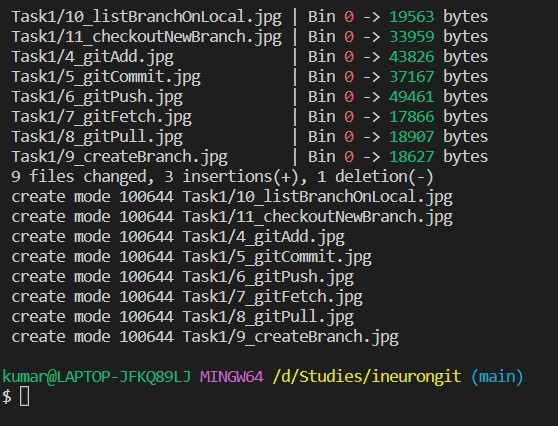

Merges changes in given branch to the current branch.

## 13. Log

```
git log
```
Example
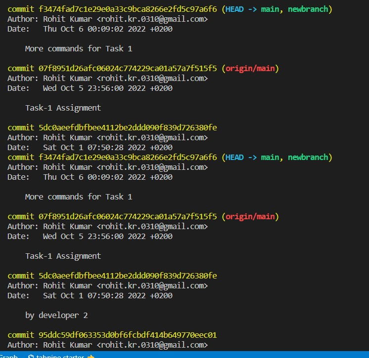

Shows commit history of the repository

## 14. Diff

```
git diff
```
Example
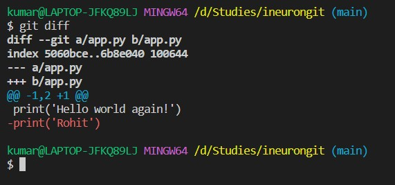

Shows changes between the current change and last commit.

## 15. Git Clone
```
git clone <repository url>
```
Clones the repository to the local machine.